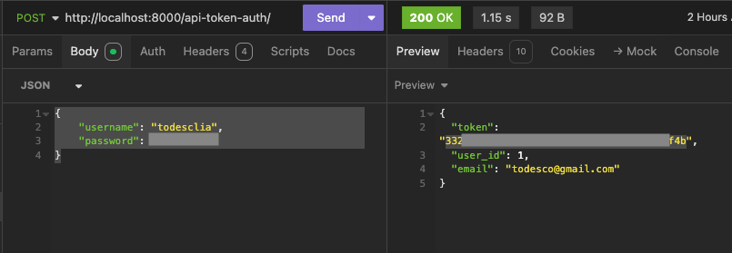

# Crowdfunding Back End

Creator: Lisa Todesco<br>
Deployed Location: https://ripplerise-759bd7191bc0.herokuapp.com/

## Planning:

### Concept/Name

__RippleRise__

Community driven microgrants program.<br>
This platform focuses on funding small, local community projects and initiatives through microgrants. Instead of large fundraising goals, projects would request small amounts for targeted initiatives like community gardens, local art installations, or neighbourhood improvement projects.

### Intended Audience

Organised by local communities or neighbourhoods.<br>
Allows residents to propose and fund projects that directly impact their community.
Also encourages local artists to get involved and provide their skills to various projects.<br>
Partner with local businesses, foundations, and government agencies such as local councils.

### User Stories

- As a Community Member, I want to easily submit project proposals for funding, so I can share my idea with potential backers.
- As a Project Creator, I want to set a funding goal and timeline for my project, so I can clearly communicate my needs to supporters.
- As a Donor/Backer, I want to browse projects by category, location or funding goal so I can find initiatives that I am interested in.
- As a Donor/Backer, I want to make pledges of varying amounts, so I can support projects that I am interested in.
- As a Platform Admin, I want to manage user accounts and remove any ilegitimate users.
- As a User, I want to create and manage my profile.
- As a User

### Front End Pages/Functionality

- {{ A page on the front end }}
  - {{ A list of dot-points showing functionality is available on this page }}
  - {{ etc }}
  - {{ etc }}
- {{ A second page available on the front end }}
  - {{ Another list of dot-points showing functionality }}
  - {{ etc }}

### API Spec

| URL                   | HTTP Method | Purpose                                   | Request Body                                                                                                                                      | Success Response Code | Authentication/Authorisation                           |
| --------------------- | ----------- | ----------------------------------------- | ------------------------------------------------------------------------------------------------------------------------------------------------- | --------------------- | ------------------------------------------------------ |
| /pledges/             | GET         | Returns all the pledges                   | N/A                                                                                                                                               | 200                   | None                                                   |
| `/pledges/<init pk>`  | GET         | Returns the details of a specific pledge  | N/A                                                                                                                                               | 200                   | None                                                   |
| /projects/            | GET         | Returns all the projects                  | N/A                                                                                                                                               | 200                   | None                                                   |
| `/projects/<init pk>` | GET         | Returns the details of a specific project | N/A                                                                                                                                               | 200                   | None                                                   |
| /users/               | GET         | Returns all the users                     | N/A                                                                                                                                               | 200                   | Must be logged in                                      |
| `/users/<init pk>`    | GET         | Returns the details of a specific user    | N/A                                                                                                                                               | 200                   | Must be logged in                                      |
| /api-token-auth/      | POST        | Returns a user token                      | {"username": "\_**\_", "password": "\_\_\_**"}                                                                                                    | 200                   | Supply the correct username and password               |
| /projects/            | POST        | Create a new project                      | {"title": "Project 7", "description": "The seventh project.", "goal": 300, "image": "**\_\_\_**.jpg", "is_open": true}                            | 201                   | Must be logged in                                      |
| /pledges/             | POST        | Create a new pledge                       | { "amount": 58, "comment": "Love this project!", "anonymous": false, "project": 6}                                                                | 201                   | Must be logged in                                      |
| /users/               | POST        | Creae a new user                          | {"username": "jexample2", "first_name": "jill", "last_name": "example", "email": "`example@gmail.com`", "password": "**\_**", "is_staff": false}  | 201                   | None                                                   |
| `/projects/<init pk>` | PUT         | Modify the details for a specific project | "title": "Project 4", "description": "The 4th project" "goal": 300, "image": "**\_**.jpg", "is_open": true,                                       | 200                   | Must be logged in as the user that created the project |
| `/pledges/<init pk>`  | PUT         | Modify the details for a specific pledge  | {"amount": 20, "comment": "Love this project!", "anonymous": false}                                                                               | 200                   | Must be logged in as the user that created the pledge  |
| `/users/<init pk>`    | PUT         | Modify the details for a specific user    | {"username": "jexample3", "first_name": "three", "last_name": "example", "email": "`example@gmail.com`", "password": "**\_**", "is_staff": false} | 200                   | Must be the same user that is logged in                |

Sample GET - <br>
<br><br>
Sample POST - <br>
<br><br>
Sample Token retrieval - <br>
<br><br>

### Permissions
As a User you're not allowed to create a new crowdfunding project unless you're logged in<br>
As a User you're not allowed to pledge to a project unless you're logged in<br>
As a User you're not allowed to modify the details of a project unless you're the one who created it<br>
As a User you're not allowed to modify the details of a user unless you're the user that is being modified<br>
As a User you're not allowed to modify the details of a pledge unless you're the one who created it<br>
Only logged in users can see the list of users

### DB Schema
<br><br>

## User Registration and Project Creation

### Register a New User

1. Send a POST request to `/users/`
2. Include the following JSON data in the request body:

   ```json
   {
       "username": "jexample9",
       "first_name": "jom",
       "last_name": "example",
       "email": "todesco+05@gmail.com",
       "password": "example05",
       "is_staff": false
       }
3. If successful, you will receive a response with the newly created user's details.
   
### Create a New Project

1. Send a POST request to `/projects/`
2. Include the following JSON data in the request body:

   ```json
   {
    "title": "Project 8",
    "description": "The eighth project.",
    "goal": 300,
    "image": "https://via.placeholder.com/300.jpg",
    "is_open": true
    }
3. If successful, you will receive a response with the newly created project's details.
   

## Project Requirements

Your crowdfunding project must:

- [ ] Be separated into two distinct projects: an API built using the Django Rest Framework and a website built using React.
- [x] Have a cool name, bonus points if it includes a pun and/or missing vowels. See https://namelix.com/ for inspiration. <sup><sup>(Bonus Points are meaningless)</sup></sup>
- [x] Have a clear target audience.
- [x] Have user accounts. A user should have at least the following attributes:
  - [x] Username
  - [x] Email address
  - [x] Password
- [x] Ability to create a “project” to be crowdfunded which will include at least the following attributes:
  - [x] Title
  - [x] Owner (a user)
  - [x] Description
  - [x] Image
  - [x] Target amount to fundraise
  - [x] Whether it is currently open to accepting new supporters or not
  - [x] When the project was created
- [x] Ability to “pledge” to a project. A pledge should include at least the following attributes:
  - [x] An amount
  - [x] The project the pledge is for
  - [x] The supporter/user (i.e. who created the pledge)
  - [x] Whether the pledge is anonymous or not
  - [x] A comment to go along with the pledge
- [x] Implement suitable update/delete functionality, e.g. should a project owner be allowed to update a project description?
- [x] Implement suitable permissions, e.g. who is allowed to delete a pledge? - a custom additional permission
- [x] Return the relevant status codes for both successful and unsuccessful requests to the API.
- [x] Handle failed requests gracefully (e.g. you should have a custom 404 page rather than the default error page).
- [x] Use Token Authentication, including an endpoint to obtain a token along with the current user's details.
- [ ] Implement responsive design.

## Additional Notes

Check off each item when done:

- [x] A link to the deployed project.
- [x] A screenshot of Insomnia, demonstrating a successful GET method for any endpoint.
- [x] A screenshot of Insomnia, demonstrating a successful POST method for any endpoint.
- [x] A screenshot of Insomnia, demonstrating a token being returned.
- [x] Step by step instructions for how to register a new user and create a new project (i.e. endpoints and body data).
- [x] Your refined API specification and Database Schema.
